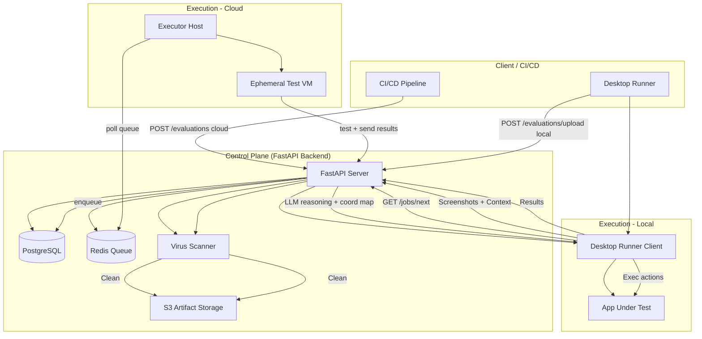
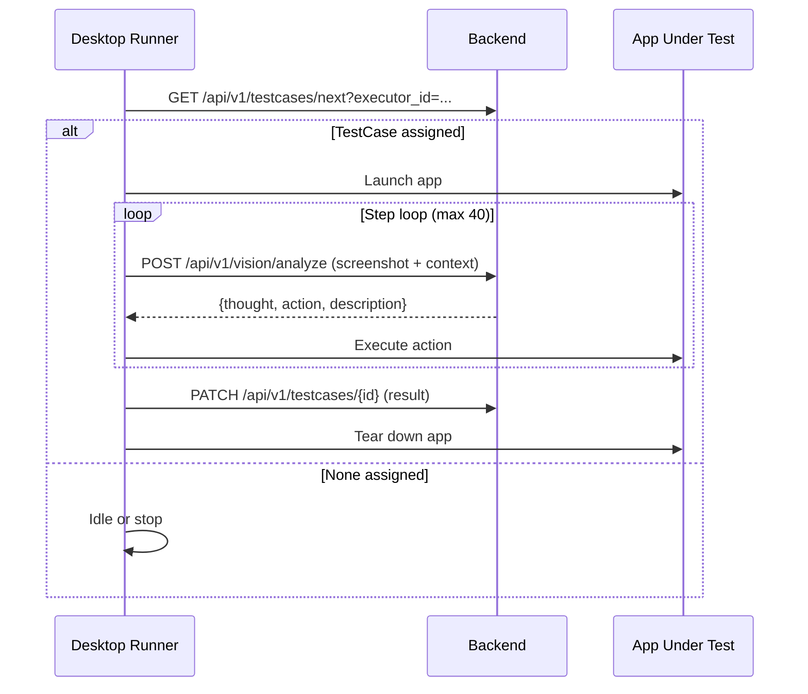
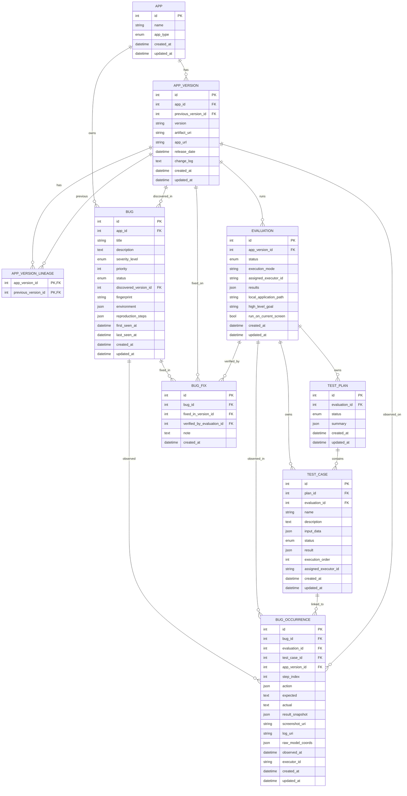

# Eval Agent

Eval Agent is an end-to-end, agentic application evaluation system that plans, executes, observes, and evaluates real applications running in real environments. It is built around a strict control plane / execution plane split: the backend owns all intelligence, and the desktop runner owns all physical interaction.

This repository was formed by merging two separate projects:

* `app_eval_desktop` -> `desktop`
* `app_evaluation_agent` -> `backend`

The unified project name is **Eval_Agent**.

## Table of Contents

- [Overview](#overview)
- [Project Lineage](#project-lineage)
- [Architecture At A Glance](#architecture-at-a-glance)
- [System Architecture Diagram](#system-architecture-diagram)
- [Execution Model](#execution-model)
- [Desktop Runner (Execution Plane)](#desktop-runner-execution-plane)
  - [Core Responsibilities](#core-responsibilities)
  - [Desktop System Architecture](#desktop-system-architecture)
  - [Data and Control Flow](#data-and-control-flow)
  - [User Interface](#user-interface)
  - [IPC Contracts](#ipc-contracts)
  - [Backend API Contract (Desktop)](#backend-api-contract-desktop)
  - [Desktop Configuration](#desktop-configuration)
  - [Desktop Build and Run](#desktop-build-and-run)
  - [Desktop Development Notes](#desktop-development-notes)
  - [Desktop Troubleshooting](#desktop-troubleshooting)
- [Backend (Control Plane)](#backend-control-plane)
  - [Product Overview](#product-overview)
  - [Core Functional Requirements](#core-functional-requirements)
  - [Evaluation System Metrics](#evaluation-system-metrics)
  - [Core Agent Design](#core-agent-design)
  - [Bug Management Specification](#bug-management-specification)
  - [Test Case Management](#test-case-management)
  - [Product Deliverables](#product-deliverables)
  - [Execution Modes](#execution-modes)
  - [High-Level Workflow](#high-level-workflow)
- [Component Breakdown](#component-breakdown)
- [Bug Tracking and Triage](#bug-tracking-and-triage)
- [Vision and Coordinate Mapping](#vision-and-coordinate-mapping)
  - [Persistence Layer](#persistence-layer)
  - [Background Tasks](#background-tasks)
  - [Integrations and Utilities](#integrations-and-utilities)
  - [Backend File Structure](#backend-file-structure)
  - [Vision Pipeline Notes](#vision-pipeline-notes)
- [Database Schema](#database-schema)
- [API Reference](#api-reference)
- [Backend Setup and Installation](#backend-setup-and-installation)
- [Testing](#testing)
- [Docs Map](#docs-map)

## Overview

Eval Agent evaluates applications by executing real steps on real targets while a backend LLM-driven control plane decides the next action. The system is intentionally split:

* **Backend (Control Plane):** planning, vision analysis, action selection, bug reasoning, metrics, storage.
* **Desktop Runner (Execution Plane):** capture, deterministic action execution, visualization.

## Project Lineage

Eval Agent is the merged successor of two projects:

* `app_eval_desktop` -> **desktop** (Electron + TypeScript executor)
* `app_evaluation_agent` -> **backend** (FastAPI control plane)

All prior architecture, endpoints, and README material has been consolidated here for a single, canonical entrypoint.

## Architecture At A Glance

* Control plane orchestrates evaluation lifecycles, test plans, test cases, LLM reasoning, bug management, and summaries.
* Execution plane performs capture and input on real machines, using deterministic action execution.
* Two execution modes are supported: secure cloud execution (headless VM) and interactive local execution (desktop runner).

## System Architecture Diagram



## Execution Model

Eval Agent uses a TestCase runner model:

1. Desktop runner polls for the next assigned TestCase.
2. If assigned, the runner launches the target application (desktop or web).
3. The runner enters a deterministic step loop, sending a screenshot + context and receiving exactly one action per step.
4. The backend terminates the TestCase with a `finish_task` action.



## Desktop Runner (Execution Plane)

App Eval Desktop is the Electron + TypeScript executor. It is intentionally thin: no local perception, UI parsing, or model inference. All reasoning and decision-making lives in the backend.

### Core Responsibilities

**Capture**

* High-performance BGRA capture via Windows Desktop Duplication API
* Multi-monitor aware
* Optional exclusion from capture (`WDA_EXCLUDEFROMCAPTURE`)
* Conversion to PNG before upload

**Execution**

* Mouse actions: click, double-click, right-click, hover, drag, scroll
* Keyboard actions: shortcuts, simulated typing
* Clipboard-based direct text entry (paste)
* Deterministic waits and task completion

**Orchestration**

* Polls backend for next assigned TestCase execution
* Runs TestCases sequentially
* Handles pause, resume, stop
* Manages app lifecycle (launch + teardown)

**Visualization**

* Live screenshot preview
* Structured logs
* Step-by-step run timeline
* Agent context inspection
* Evaluation and TestCase history

### Desktop System Architecture

```
desktop/
├── scripts/
│   ├── utils/copy-recursive.js
│   ├── copy-renderer.js
│   └── copy-native.js
├── src/
│   ├── main.ts              # Electron entry, windows, IPC
│   ├── preload.ts           # Secure IPC bridge
│   ├── config.ts            # Runtime configuration
│   │
│   ├── core/
│   │   ├── orchestrator.ts  # TestCase runner loop
│   │   ├── context.ts       # AgentExecutionContext
│   │   └── logger.ts        # Structured logging
│   │
│   ├── agent/
│   │   ├── executor.ts      # nut-js action executor
│   │   ├── coord-mapper.ts  # analysis/capture -> screen mapping
│   │   └── capture/native/  # C++ Desktop Duplication addon
│   │
│   ├── api/
│   │   └── client.ts        # REST + vision calls
│   │
│   ├── renderer/
│   │   ├── locales/
│   │   ├── pages/
│   │   ├── shared/
│   │   └── styles/
│   │
│   └── types/
│       └── evaluations.d.ts
├── test/
│   └── test-window-capture.ts
```

### Data and Control Flow

**Per-step loop**

1. Capture native screenshot -> PNG (with brightness sanity checks).
2. Assemble `AgentExecutionContext` and last focus coordinates.
3. POST screenshot + context to `/api/v1/vision/analyze`.
4. Receive `{ thought, action, description }`.
5. Map coordinates via `coord-mapper.ts` and execute.
6. Update scratchpad, action history, and UI timeline.

### User Interface

**Agent View (Run)**

* Live screenshot preview
* Step timeline (thought + action + screenshot)
* Structured logs (SYSTEM / JOB / AGENT / TOOL / CAPTURE / WARN / ERROR)
* Pause / resume
* Compact mode toggle

**Apps**

* Browse apps, versions, and evaluations
* Focus a lineage branch and reset focus
* Create apps + versions (upload or URL)
* Delete apps or versions
* Jump to evaluation history

**Evaluations**

* Assigned evaluations list
* Metadata: goal, app type, timestamps
* Link to history
* Delete evaluation
* Regenerate or edit summary (for completed evaluations)

**History**

* Infinite scroll TestCase history
* Markdown rendering of results
* Copy / download summary
* Re-run TestCase

**Bugs**

* Bug list per app with filtering and search
* Create, edit, delete bugs (status, severity, priority, fingerprint)
* Track occurrences tied to evaluations/TestCases
* Record branch-scoped fixes and verification notes

**Compact Mode**

* Always-on-top minimal window
* Logs + status
* Execution controls

### IPC Contracts

Renderer communicates only via preload IPC. Key channels include:

* `getAssignedEvaluations`
* `fetchEvaluation`
* `deleteEvaluation`
* `run:start / pause / resume / stop`
* `injectHumanPrompt`
* `agent-context-updated`
* `evaluation-attached`
* `run-timeline-entry`
* `history:refresh`
* `getLogBuffer / onLogUpdate`
* `listBugs / getBug / createBug / updateBug / deleteBug`
* `listBugOccurrences / createBugOccurrence`
* `listBugFixes / createBugFix / deleteBugFix`

### Backend API Contract (Desktop)

Key endpoints used by the desktop runner:

* `GET /api/v1/apps`
* `POST /api/v1/apps`
* `DELETE /api/v1/apps/{app_id}`
* `GET /api/v1/apps/{app_id}/versions`
* `POST /api/v1/apps/{app_id}/versions`
* `DELETE /api/v1/apps/{app_id}/versions/{version_id}`
* `GET /api/v1/apps/{app_id}/versions/{version_id}/evaluations`
* `GET /api/v1/apps/{app_id}/bugs`
* `POST /api/v1/bugs`
* `GET /api/v1/bugs/{bug_id}`
* `PATCH /api/v1/bugs/{bug_id}`
* `DELETE /api/v1/bugs/{bug_id}`
* `GET /api/v1/bugs/{bug_id}/occurrences`
* `POST /api/v1/bugs/{bug_id}/occurrences`
* `GET /api/v1/bugs/{bug_id}/fixes`
* `POST /api/v1/bugs/{bug_id}/fixes`
* `DELETE /api/v1/bugs/{bug_id}/fixes/{fix_id}`
* `GET /api/v1/testcases/next`
* `PATCH /api/v1/testcases/{id}`
* `POST /api/v1/vision/analyze`
* `GET /api/v1/evaluations/{id}`
* `PATCH /api/v1/evaluations/{id}/summary`
* `POST /api/v1/evaluations/{id}/regenerate-summary`

See `docs/endpoints.md` for the authoritative schema.

### Desktop Configuration

`.env`:

```env
API_BASE_URL=http://127.0.0.1:8000
EXECUTOR_ID=<unique-machine-id>
```

Additional behavior:

* Capture defaults controlled in `desktop/src/config.ts`
* Theme, language, executor ID configurable via Settings UI
* Executor ID persists across restarts

### Desktop Build and Run

Install dependencies:

```bash
npm install
```

Build:

```bash
npm run build
```

Dev (renderer + Electron with Vite HMR):

```bash
npm run dev
```

Dev (separate terminals):

```bash
npm run dev:renderer
npm run dev:electron
```

Run:

```bash
npm start
```

Package:

```bash
npm run make
```

Test native capture:

```bash
npx ts-node test/test-window-capture.ts
```

### Desktop Development Notes

* Renderer is fully sandboxed (no Node access)
* All side effects happen in `main` / `orchestrator`
* Vision is non-streaming
* Clipboard is restored after direct text entry
* Click-through is reference-counted to avoid stuck windows
* Max 40 steps per TestCase

### Desktop Troubleshooting

**No screenshots**

* Rebuild native addon
* Update GPU drivers
* Run capture test script

**Actions misaligned**

* Check `space` + `normalized` flags
* Verify capture resolution vs model space
* Inspect `desktop/src/agent/coord-mapper.ts`

**Agent stuck**

* Confirm backend returns `finish_task`
* Check TestCase status transitions
* Inspect vision analyze logs

## Backend (Control Plane)

### Product Overview

The backend is an AI-based automated application evaluation system. It uses a visual multimodal model and multi-agent collaboration to achieve end-to-end app exploration, evaluation metric calculation, full bug lifecycle management, and test case generation.

### Core Functional Requirements

**App Information Parsing**

* Textual material grading
  * Level 1: functional brief of <=200 words
  * Level 2: introductory guide covering basic operations
  * Level 3: full official documentation/manual
* Interface understanding
  * Automatically detects and classifies UI elements (buttons, inputs, icons)
  * Supports structural layout parsing

**Automated Evaluation Process**

1. Test case generation
2. Feature exploration execution
3. Bug detection and management
4. Version difference analysis
5. Evaluation metric calculation
6. Evaluation report generation

### Evaluation System Metrics

| Metric           | Calculation Method                                                               | Core Parameters           |
| ---------------- | -------------------------------------------------------------------------------- | ------------------------- |
| Stability        | `1 - (Crash Rate * 0.7 + Functional Abnormality Rate * 0.3)`                     | Crash Count / Total Tasks |
| Usability        | `1 - (Step Efficiency * 0.5 + Time Efficiency * 0.5)`                            | Steps / Avg Steps         |
| Learnability     | `(1 - Basic Exploration Efficiency) * Text Level Coeff + Feature Coverage * 0.2` | Exploration time / Avg    |
| Completeness     | `Feature Coverage * 0.4 + Integrity * 0.6`                                       | Implemented Features      |

### Core Agent Design

* `app_evaluation_agent/services/agents/coordinator.py`: **CoordinatorAgent** (bootstraps plans and test cases)
* `app_evaluation_agent/services/agents/planner.py`: **PlannerAgent** (LLM plan + test case generation)
* `app_evaluation_agent/services/agents/analyzer.py`: **AnalyzerAgent** (vision analysis + coordinate mapping)
* `app_evaluation_agent/services/agents/summarizer.py`: **SummarizerAgent** (final evaluation summary)
* `app_evaluation_agent/services/agents/bug_triage.py`: **BugTriageAgent** (extracts bugs from results)

### Bug Management Specification

**Severity level definitions**

| Level | Definition          | Response Time      | Example               |
| ----- | ------------------- | ------------------ | --------------------- |
| P0    | Critical blocker    | 24 hours           | Crash on launch       |
| P1    | Severe abnormality  | 3 days             | Payment cannot submit |
| P2    | General abnormality | One iteration      | Button unresponsive   |
| P3    | Minor issue         | Next major release | UI contrast issue     |

**Status transition rules**

`New -> In Progress -> Pending Verification -> Closed -> (optional Reopen)`

### Test Case Management

**General Task Description**

* Task ID
* Description
* Expected Result
* Priority

**Version-Specific Steps**

* Numbered operational steps for each version

### Product Deliverables

* Functional specification
* Evaluation report
* Bug list
* Bug tracking sheet
* Test case set
* Operation process dataset

### Execution Modes

**Secure Cloud Execution (Headless VM Testing)**

* Intended for CI/CD, regression testing, and scalable automation
* Backend enqueues background tasks via Redis ARQ
* Cloud executor (outside this repo) consumes jobs and launches ephemeral VMs

**Interactive Local Execution (Desktop Runner)**

* Used for developer debugging and exploratory testing
* Desktop runner polls for test cases, captures screenshots, and executes actions locally
* Coordinate correction is handled server-side

### High-Level Workflow

**Cloud path**

1. Client or CI submits an evaluation
2. Backend scans and stores artifacts
3. Evaluation is enqueued via Redis
4. Cloud executor pulls the job
5. VM runs the app headlessly
6. Results are sent back and persisted

**Local path**

1. Desktop runner uploads or selects an evaluation
2. Backend scans and stores artifacts
3. Runner polls `/testcases/next`
4. Runner captures screenshots and sends context
5. Backend vision agent returns actions
6. Runner executes actions locally
7. Results are stored and summarized

### Component Breakdown

**Entry and API Layer**

* FastAPI app: `backend/app_evaluation_agent/main.py`
* Routes under `api/v1/`:
  * `apps.py` - app + version management
  * `evaluations.py` - evaluation CRUD and lifecycle
  * `testplans.py` - test plan access
  * `testcases.py` - test case assignment and updates
  * `vision.py` - screenshot + LLM vision reasoning
  * `logs.py` - log streaming/export

**Agent Layer (`services/agents/`)**

* PlannerAgent: generates high-level plans and test cases
* CoordinatorAgent: bootstraps evaluations and assigns test cases to executors
* AnalyzerAgent: handles `/vision/analyze`, builds prompts, calls vLLM, remaps coords
* SummarizerAgent: produces final evaluation reports after test case completion
* BugTriageAgent: extracts and dedupes bugs by fingerprint
* LLM client: `llm_client.py`

**Business Services**

* `services/apps.py` - app + version management, evaluation creation
* `services/evaluations.py` - evaluation lifecycle and planner bootstrap
* `services/testcases.py` - test case assignment, completion, bug triage

### Bug Tracking and Triage

* Bug extraction happens when a runner patches a test case with results via `PATCH /api/v1/testcases/{testcase_id}`.
* `BugTriageAgent` parses result payloads and emits 0..N bug drafts.
* Bugs are deduped per app by `fingerprint`, with `last_seen_at` updated on repeats.
* Each observation is stored as a `BUG_OCCURRENCE` linked to evaluation, test case, app version, step index, action/expected/actual, plus optional artifact URIs.
* Fixes are recorded in `BUG_FIX` with `fixed_in_version_id` and optional `verified_by_evaluation_id`.
* Severity/status enums are validated; state transitions are not enforced by the backend.

### Vision and Coordinate Mapping

* AnalyzerAgent consumes screenshot + AgentContext and calls the vision LLM
* Coordinates are remapped using `services/vllm_coordinate_mapper.py`
* Supports letterboxing, normalization, and capture origin offsets

### Persistence Layer

* SQLAlchemy models: `backend/app_evaluation_agent/storage/models.py`
* Async engine/session: `backend/app_evaluation_agent/storage/database.py`
* Schemas: `backend/app_evaluation_agent/schemas/`
* Migrations: Alembic (`backend/alembic/`)

### Background Tasks

* Redis ARQ worker: `backend/app_evaluation_agent/worker.py`
* Used for summarization and cloud job enqueueing
* Local execution bypasses Redis where possible

### Integrations and Utilities

* Config: `backend/app_evaluation_agent/utils/config.py` (TOML-based)
* Virus scanning: `backend/app_evaluation_agent/integrations/virus_scanner.py`
* Artifact storage: `backend/app_evaluation_agent/integrations/s3_client.py`
* Real-time events: `backend/app_evaluation_agent/realtime.py`
* Logging: `backend/app_evaluation_agent/logging_utils.py`

### Backend File Structure

```
backend/app_evaluation_agent/
├── main.py
├── worker.py
├── logging_utils.py
├── logs/
├── api/
│   └── v1/
│       ├── apps.py
│       ├── evaluations.py
│       ├── testplans.py
│       ├── testcases.py
│       ├── vision.py
│       └── logs.py
├── services/
│   ├── apps.py
│   ├── agents/
│   │   ├── planner.py
│   │   ├── coordinator.py
│   │   ├── analyzer.py
│   │   ├── summarizer.py
│   │   ├── bug_triage.py
│   │   ├── llm_client.py
│   │   └── prompt_loader.py
│   ├── prompts/
│   │   ├── planner/
│   │   ├── bug_triage/
│   │   └── summarizer/
│   ├── evaluations.py
│   ├── testcases.py
│   └── vllm_coordinate_mapper.py
├── storage/
│   ├── models.py
│   └── database.py
├── schemas/
│   ├── evaluation.py
│   ├── testplan.py
│   ├── testcase.py
│   └── agent.py
├── integrations/
│   ├── virus_scanner.py
│   └── s3_client.py
└── utils/
    └── config.py
```

### Vision Pipeline Notes

* Classical UI element detection is currently disabled
* Vision endpoints accept a PNG screenshot and execution context
* Returned model coordinates are preserved as raw values and remapped to screen pixels
* This design supports future detector insertion and coordinate drift debugging

## Database Schema



## API Reference

The canonical API documentation lives at `docs/endpoints.md`. Use the interactive docs when running the backend:

* `/docs` (Swagger UI)
* `/redoc`

Key operational endpoints:

* `POST /api/v1/evaluations` (JSON)
* `POST /api/v1/evaluations/upload` (desktop app upload)
* `POST /api/v1/evaluations/url` (web app URL)
* `POST /api/v1/evaluations/live` (use runner current screen)
* `GET /api/v1/testplans/{plan_id}`
* `GET /api/v1/testcases/next`
* `PATCH /api/v1/testcases/{testcase_id}`
* `POST /api/v1/bugs`
* `GET /api/v1/bugs/{bug_id}`
* `PATCH /api/v1/bugs/{bug_id}`
* `DELETE /api/v1/bugs/{bug_id}`
* `GET /api/v1/bugs/{bug_id}/occurrences`
* `POST /api/v1/bugs/{bug_id}/occurrences`
* `GET /api/v1/bugs/{bug_id}/fixes`
* `POST /api/v1/bugs/{bug_id}/fixes`
* `DELETE /api/v1/bugs/{bug_id}/fixes/{fix_id}`
* `POST /api/v1/vision/analyze`
* `GET /api/v1/logs/export`

## Backend Setup and Installation

**Prerequisites**

* Python 3.10+
* Poetry
* Docker + Docker Compose

**1) Clone**

```bash
git clone https://github.com/Region-AI/EvalAgent
cd Eval_Agent
```

**2) Install dependencies**

```bash
cd backend
poetry install
```

**3) Configure**

```bash
cp config/settings.example.toml config/settings.toml
```

Edit `backend/config/settings.toml` to configure:

* PostgreSQL URL
* Redis host
* LLM base URL and API key
* Model paths (if applicable)

**4) Start backend services**

```bash
cp docker-compose.example.yaml docker-compose.yaml
docker-compose up -d
```

**5) Run migrations**

```bash
cp env.example.py alembic/env.py
poetry run alembic upgrade head
```

**6) Run the backend**

Terminal 1 (background worker):

```bash
arq app_evaluation_agent.worker.WorkerSettings
```

Terminal 2 (API server):

```bash
uvicorn app_evaluation_agent.main:app --reload
```

API docs are available at `http://127.0.0.1:8000/docs`.

## Testing

**Backend**

Most vision tests depend on a configured LLM endpoint and `screenshot.png` fixture:

```bash
cd backend
poetry run pytest tests/test_vllm_coordinate_mapper.py -q
```

**Desktop**

```bash
cd desktop
npx ts-node test/test-window-capture.ts
```

## Docs Map

* `docs/overview.md`
* `docs/architecture.md`
* `docs/backend.md`
* `docs/desktop.md`
* `docs/endpoints.md`
* `docs/troubleshooting.md`
* `ARCHITECTURE_backend.md` (legacy full backend architecture)
* `ARCHITECTURE_frontend.md` (legacy full desktop architecture)
* `README_backend.md` (legacy backend README)
* `README_frontend.md` (legacy desktop README)

## Star History

[](https://star-history.com/#Region-AI/EvalAgent&Date)

## License

Apache-2.0. See `LICENSE`.
